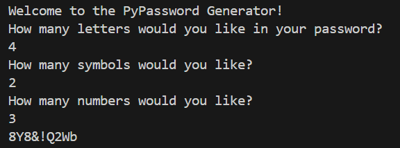

<h3>Password_Generator</h3>

This password generator is built in Python. 
The user can select on the terminal the amount of symbols, letters and/or numbers he wants on his password.
The password given is the result of the amound of characters the user selected, given randomly.
Feel free to test it out !

